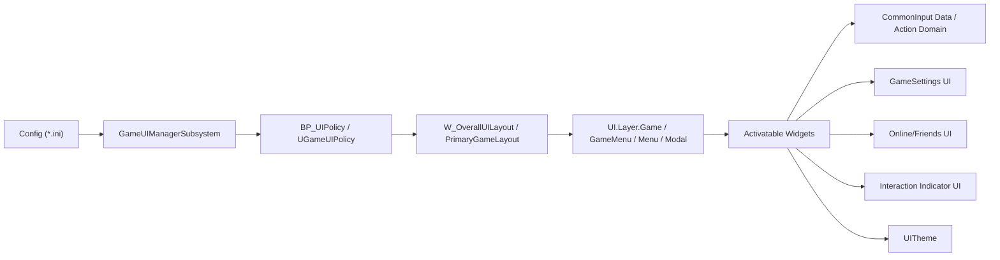
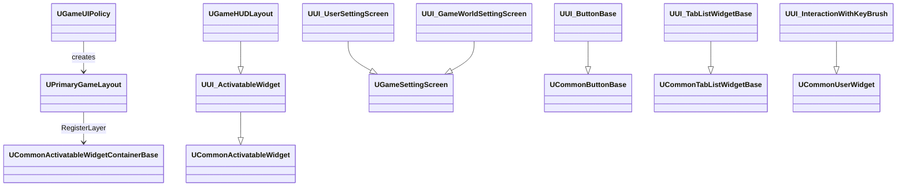
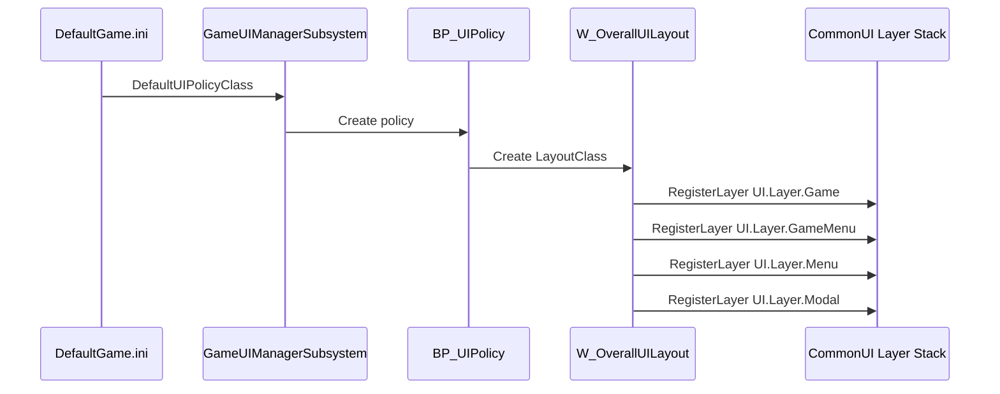
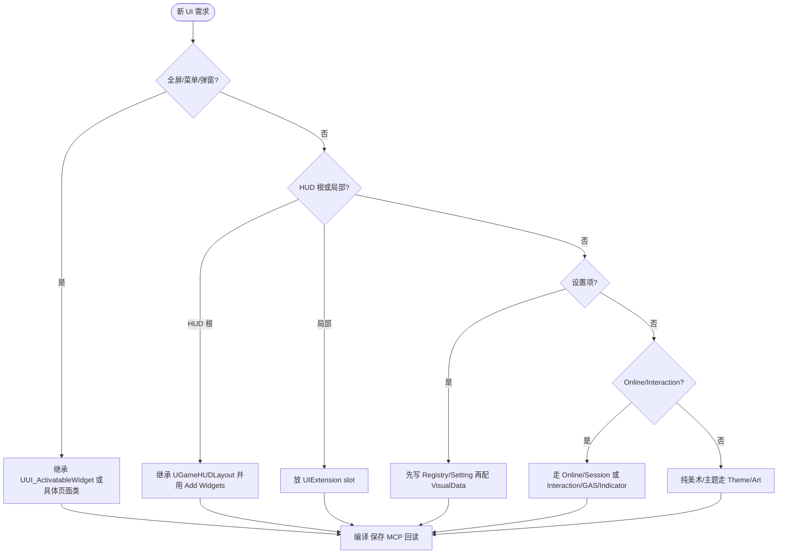

# UI 蓝图框架总览

## 目录

- 目标和证据边界
- 总体架构
- 资产职责矩阵
- C++ 基类契约
- Blueprint 编写方式
- 新增 UI 功能决策
- Mermaid 文本 UML 图
- 验证清单

## 目标和证据边界

本手册用于让 Codex 在修改或创建 `Content/UI` 蓝图时，先理解现有框架，再模仿现有做法落地。它覆盖这些目标资产族：

- `Content/UI/Art`
- `Content/UI/HUD`
- `Content/UI/Interaction`
- `Content/UI/Menu`
- `Content/UI/Online`
- `Content/UI/Settings`
- `Content/UI/BP_CommonInputData`
- `Content/UI/BP_UIPolicy`
- `Content/UI/DA_GameUIInputActionDomainTable`
- `Content/UI/DT_UniversalActions`
- `Content/UI/W_OverallUILayout`

证据优先级：

1. UE 5.8 MCP 回读的 parent、WidgetTree、Graph、默认属性和 Toolset schema。
2. `Source/GameUI`、`Plugins/Common/CommonGame`、`Plugins/GameSettings`、`Plugins/Common/CommonLoadingScreen`、`Plugins/GameInventorySystem`、`Plugins/OrionSteam` 的 C++ 源码。
3. `Config/*.ini` 中的 UI policy、CommonInput、LoadingScreen、GameplayTag 和平台输入配置。
4. 离线 `.uasset` 字符串只用于补充 DataTable 行名或资产引用线索；不要用它替代 MCP/Editor 回读。

已验证 MCP 事实：

- UE 5.8 MCP deferred loading 可用，初始工具是 `list_toolsets`、`describe_toolset`、`load_toolset`。
- `load_toolset` 参数名是 `toolset_name`。
- 已加载官方 `AssetTools`、`ObjectTools`、`BlueprintTools`、`UMGToolSet`，以及项目 `OrionProjectToolsets.OrionUMGToolset`。
- `W_OverallUILayout` 已通过 MCP 深读：parent 为 `/Script/CommonGame.PrimaryGameLayout`，root widget 为 `/Script/UMG.Overlay`，WidgetTree 包含 `MainOverlay` 与四个 CommonActivatableWidgetStack，EventGraph 在 `OnInitialized` 中依次注册四个 `UI.Layer.*`。
- `BP_UIPolicy` 的 `LayoutClass` 指向 `/Game/UI/W_OverallUILayout.W_OverallUILayout_C`。
- `BP_CommonInputData` 的 `defaultClickAction` 是 `DT_UniversalActions.DefaultForward`，`defaultBackAction` 是 `DT_UniversalActions.DefaultBack`。
- `DA_GameUIInputActionDomainTable` 的 `secondBackAction` 是 `DT_UniversalActions.SecondBack`，`inputMode=Game`，`mouseCaptureMode=CapturePermanently`。

## 总体架构

UI 根由 CommonGame policy 创建：

1. `UGameUIManagerSubsystemBase` 从 `DefaultGame.ini` 读取 `DefaultUIPolicyClass`。
2. `UGameUIPolicy` 为每个 local player 创建 `UPrimaryGameLayout`。
3. `W_OverallUILayout` 继承 `UPrimaryGameLayout`，在蓝图 EventGraph 注册 `UI.Layer.Game`、`UI.Layer.GameMenu`、`UI.Layer.Menu`、`UI.Layer.Modal`。
4. 全屏 UI、菜单、弹窗、HUD layout 通过 `CommonUIExtensions` 或 GameFeature `Add Widgets` 推入层栈。
5. 局部 HUD 元素通过 UIExtension slot 接入；交互提示通过 IndicatorSystem 接入。

CommonInput 和设置系统横切所有 UI：

- `BP_CommonInputData` 提供默认 click/back DataTable row。
- `DA_GameUIInputActionDomainTable` 扩展 Action Domain，额外提供项目的 second back action。
- `DT_UniversalActions` 保存 `DefaultForward`、`DefaultBack`、`SecondBack` 等 CommonInput action rows。
- Settings UI 使用 GameSettings 插件的 registry、screen、panel、list entry 和 VisualData 映射。

## 资产职责矩阵

| 资产族 | 主要资产 | 作用 | 扩展方式 |
| --- | --- | --- | --- |
| Root/Layout | `BP_UIPolicy`、`W_OverallUILayout` | 为 local player 创建根布局并注册 CommonUI layer stack。 | 新增 layer 时先加 GameplayTag，再在 `W_OverallUILayout` 增加 stack 并在 `OnInitialized` 调 `RegisterLayer`。 |
| CommonInput | `BP_CommonInputData`、`DT_UniversalActions`、`DA_GameUIInputActionDomainTable` | 默认 click/back、second back、Action Domain 输入模式。 | 新增 UI action row 后配置 DataTable、CommonInput data 或 action domain，不在页面里硬编码按键。 |
| Art/Theme | `DA_UITheme_*`、`W_ArtBorderStyle*` | 主题色与可响应主题变化的美术框控件。 | 主题数据走 `UUIThemeData`；控件实现或继承 `IUIThemeInterface` / Themed widget。 |
| HUD | `BP_HUD`、`W_DefaultHUDLayout` | HUD actor 与 HUD 根布局。 | 玩法 HUD 用 `UGameHUDLayout`，通过 Experience/GameFeature Add Widgets 添加到 `UI.Layer.Game`。 |
| Interaction | `W_Interact`、`W_InteractionWithKeyBrush` | 交互提示和 CommonActionWidget key brush。 | 交互业务走 InteractionSystem/GAS；Widget 只显示 `FInteractionOption` 和输入图标。 |
| Menu | `W_FrontEnd`、`W_StartUp`、`W_GameMenu`、Archive/Experience 页面 | 前端、启动、局内菜单、存档、模式/Session 页面。 | 页面优先继承 `UUI_ActivatableWidget` 或具体 C++ 基类，按钮/Tab/List 复用框架控件。 |
| Online | `W_FriendsScreen`、`W_FriendsListEntry*` | 好友列表、邀请入口、Steam/Online UI。 | UI 调 FriendManager/Session component；不要直接 travel。 |
| Settings | `W_SettingScreen`、`GameSettingRegistryVisuals`、Entry widgets | 玩家设置、世界设置、输入改键、VisualData 映射。 | 新设置先加 registry/setting，再补 VisualData 和 Entry；不要在 Widget graph 写保存逻辑。 |
| LoadingScreen link | `W_LoadingScreen_Host` 等 | 运行期加载屏外观与进度显示。 | 生命周期走 `ULoadingScreenManager`；不要手动 `AddToViewport`。 |

## C++ 基类契约

| C++ 类型 | Blueprint 责任 | 必须注意 |
| --- | --- | --- |
| `UGameUIPolicy` | `BP_UIPolicy` 只配置 `LayoutClass`。 | Layout class 必须是 `UPrimaryGameLayout` 派生。 |
| `UPrimaryGameLayout` | `W_OverallUILayout` 提供 layer stack 控件并调用 `RegisterLayer`。 | Layer tag 必须是有效 `UI.Layer.*`；Widget 变量名要稳定。 |
| `UUI_ActivatableWidget` | 菜单/弹窗/页面设置 `InputConfig`、焦点、back/second back。 | 全屏页面应实现 desired focus；业务不要塞进 Widget graph。 |
| `UGameHUDLayout` | HUD layout 配置 `EscapeMenuClass` 和手柄断开屏幕。 | Escape 推 `UI.Layer.Menu`；HUD 由 Experience/GameFeature 添加。 |
| `UUI_ButtonBase` | BP 实现 `UpdateButtonText`、`UpdateButtonStyle`，绑定文本/icon。 | 文案用 `FText`；CommonActionWidget 驱动输入提示。 |
| `UUI_TabListWidgetBase` | BP 配置 `PreregisteredTabInfoArray` 和 tab/content class。 | `FTabDescriptor.TabId` 稳定；隐藏 tab 不注册。 |
| `UUI_ListView` / `UUI_WidgetFactory` | BP 配置 `FactoryRules`，列表按数据 class 创建 entry。 | 缺少 mapping 会导致 entry 不可创建或回退。 |
| `UUI_UserSettingScreen` | BP 放 Settings panel、tab、apply/cancel/back UI。 | Registry、Apply、Cancel、dirty 逻辑在 C++/GameSettings。 |
| `UUI_GameWorldSettingScreen` | BP 放世界设置 panel、确认/取消按钮。 | Confirm 会保存世界设置并根据前端 phase 继续流程。 |
| `UUI_UserSettingsListEntry_Input` | BP 提供四个 key button 和弹窗 class。 | 改键走 `UGameSettingInput` 和 EnhancedInput user settings。 |
| `UUI_FriendsScreen` / Entry | BP 提供 ListView、头像、名字、邀请按钮。 | 好友数据来自 FriendManager/Steam wrapper；UI 不直接处理 travel。 |
| `UUI_InteractionWithKeyBrush` | BP 提供 `InputActionWidget` 并配置 `InputAction`。 | `NativeConstruct` 设置 EnhancedInput action，key brush 随输入设备变化。 |
| `UUIThemeData` / themed widgets | BP/DA 配置主题色和视觉样式。 | 主题切换通过 `UUIThemeSubsystem` 广播。 |

## Blueprint 编写方式

现有蓝图风格是“C++ 驱动行为，Widget BP 表达布局”：

- Data-only BP：`BP_UIPolicy`、`BP_CommonInputData` 只改默认属性。
- Root layout BP：`W_OverallUILayout` 使用很少节点，只在 `OnInitialized` 注册 layer。
- 页面 BP：优先继承具体 C++ 页面类，补齐 BindWidget 控件、动画、默认变量和可实现事件。
- 按钮/Tab/List Entry：继承框架控件，依靠 C++ 绑定和 BlueprintImplementableEvent 更新表现。
- Settings Entry：由 `GameSettingVisualData` 映射，Widget BP 不拥有 setting 存储。

不要做：

- 不要直接在 UI 中 `AddToViewport` 绕过 `UPrimaryGameLayout`。
- 不要在 Widget graph 中创建 Session、Join Session、保存设置、修改库存或执行服务器权威交互。
- 不要硬编码手柄/键鼠贴图路径；用 CommonInput / CommonActionWidget / key brush provider。
- 不要凭离线 `.uasset` 字符串猜 WidgetTree 属性；用 MCP `GetWidgets` 和 `ObjectTools.list_properties`。

## 新增 UI 功能决策

1. 是全屏页面、菜单或弹窗：继承 `UUI_ActivatableWidget` 或具体页面类，推入 `UI.Layer.Menu` 或 `UI.Layer.Modal`。
2. 是玩法 HUD 根布局：继承 `UGameHUDLayout`，通过 Experience/GameFeature Add Widgets 加入 `UI.Layer.Game`。
3. 是 HUD 局部元素：放入页面里的 UIExtension slot，GameFeature 用 Add Widgets 注册 widget。
4. 是设置项：先新增 registry setting，再确认 VisualData 映射和 Entry widget。
5. 是在线/好友/房间 UI：复用 GameUI Online 基类，业务走 Session component / CommonSession。
6. 是交互提示：业务走 InteractionSystem/GAS/Indicator；Widget 只显示文本和 key brush。
7. 是主题/美术框：走 `UUIThemeData`、Themed widget、材质/贴图资源，不引入业务状态。
8. 是加载屏：走 LoadingScreen framework，不手动 viewport。

## Mermaid 文本 UML 图

### 工具选择

本 Skill 的文档图表统一使用 Mermaid fenced code block 作为 canonical 图源：

| 工具 | 结论 | 原因 |
| --- | --- | --- |
| Mermaid | 首选 | Markdown 原生支持面广；可直接写在 `.md` 中；不依赖网络链接；Codex 能直接读取和解析 flowchart、classDiagram、sequenceDiagram 等结构。 |
| PlantUML | 备选 | UML 表达更强，但 Markdown 渲染通常需要本地插件、Java/Graphviz 或额外渲染步骤；不适合作为分发 Skill 的默认依赖。 |
| 外部白板或截图 | 不作为文档依赖 | 需要额外文件或外部链接，不能保证随 Skill 离线分发；本 Skill 文档必须离线完整。 |

维护规则：

1. 所有架构图、类图、时序图、流程图优先写成 `mermaid` fenced code block。
2. 需要更严格 UML 语义且 Mermaid 难以表达时，可额外附加 `plantuml` fenced code block，但必须保留 Mermaid 或文字说明作为可读版本。
3. 不要把图表唯一来源放在外部链接、截图或二进制文件中。
4. 图中节点名优先使用公开类名、资产名、GameplayTag 和系统名，避免本机路径。

### 包图

### 类图

### Root Layout 时序图

### 创建新 UI 的流程图

## 验证清单

- MCP 能连接并加载官方 `AssetTools`、`ObjectTools`、`BlueprintTools`、`UMGToolSet`。
- 目标 Widget BP 的 parent class 符合用途。
- BindWidget 名称与 C++ 属性完全一致。
- 页面有合理 `InputConfig`、back/second back、desired focus。
- `W_OverallUILayout` layer tag、stack 变量和 `RegisterLayer` 一一对应。
- Settings 新设置有 registry、VisualData、Entry、Apply/Cancel/Save 语义。
- Online/Interaction UI 不直接做业务权威操作。
- 修改后执行 compile、save、重新 MCP 回读。
