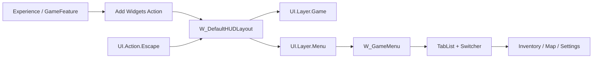

# HUD / Menu / Archive / Button / Tab

## 资产族

| 目录 | 代表资产 | 作用 |
| --- | --- | --- |
| `Content/UI/HUD` | `BP_HUD`、`W_DefaultHUDLayout` | 玩家 HUD actor 与 HUD 根布局。 |
| `Content/UI/Menu` | `W_FrontEnd`、`W_StartUp`、`W_MenuButton`、`W_MainMenuGameModeButton` | 前端主菜单、启动 Press Any Key、按钮和页面。 |
| `Content/UI/Menu/GameMenu` | `W_GameMenu`、`W_GameMenu_Setting`、`W_GameMenu_*` | 局内暂停/角色菜单、设置页入口和分页面。 |
| `Content/UI/Menu/Archive` | `W_ArchiveScreen`、`W_ArchiveListEntry_*`、`W_ArchiveActionBar` | 存档列表、新游戏/加载游戏、存档操作条。 |
| `Content/UI/Menu/Experiences` | `W_SessionBrowserScreen`、`W_GameEntryButton`、`W_FFA_*` | 模式入口、Session 浏览和玩法入口按钮。 |

## HUD

`BP_HUD` 继承 `AGameHUD`，是 Gameplay Framework 中的 HUD actor。通常不要在 HUD actor 中塞具体 UI 页面；UI 页面由 Experience/GameFeature Add Widgets 接入。

`W_DefaultHUDLayout` 继承 `UGameHUDLayout`。C++ 基类负责：

- 绑定 `UI.Action.Escape`。
- Escape 时把 `EscapeMenuClass` 推入 `UI.Layer.Menu`。
- 根据平台 trait 显示 controller disconnected screen。

扩展 HUD 时：

1. 根布局继承 `UGameHUDLayout`。
2. 局部 HUD 元素用 UIExtension slot 或 GameFeature Add Widgets 的 `Widgets` entry。
3. 玩法专属 HUD 放对应 GameFeature 的 `Content/UI`。
4. 不要在 HUD actor 或 Widget graph 中直接 AddToViewport。

## FrontEnd / StartUp

`UUI_FrontEndScreen`：

- 继承 `UUI_ActivatableWidget`。
- `NativeOnInitialized` 绑定 `UI.Action.Escape`。
- Escape 调 BlueprintImplementableEvent `QuitGame`。

`UUI_StartUpScreen`：

- 继承 `UUI_ActivatableWidget`。
- 激活时注册 input preprocessor，按任意键后调用 BlueprintImplementableEvent `OnPressedAnyKey`。
- `ContinueFlow` 从 GameState 查前端状态组件并推进控制流。

蓝图职责：

- `W_FrontEnd` 实现主菜单视觉、页面切换、按钮布局和 `QuitGame` 表现。
- `W_StartUp` 实现 Press Any Key 的动画、提示和 `OnPressedAnyKey` 表现。
- 前端流程状态不要写进 Widget graph；保留在前端状态组件和 phase 系统。

## GameMenu

`UUI_GameMenuScreen`：

- 继承 `UUI_ActivatableWidget`。
- 必需 BindWidget：`OptionsSwitcher`。
- 可选 BindWidget 标注为 optional 的 `TopOptionTabs` 在当前 C++ 中会被直接调用 `SetLinkedSwitcher`，所以对应 BP 必须实际提供该控件，除非先修 C++ 空指针保护。

蓝图模式：

- `W_GameMenu` 作为 Tab + Switcher 根。
- `W_GameMenu_Setting` 可复用 Settings screen。
- `W_GameMenu_Inventory`、`W_GameMenu_Map`、`W_GameMenu_Loadouts` 等作为 switcher content。

扩展：

1. 新增局内菜单页时，新增 content widget。
2. 在 Tab list 的 `PreregisteredTabInfoArray` 里补 `FTabDescriptor`。
3. `TabId` 要稳定；`TabButtonType` 指向按钮类；`TabContentType` 指向页面类。
4. 验证键鼠/手柄焦点和返回。

## Archive

`UUI_ArchiveScreen`：

- 继承 `UUI_ActivatableWidget`。
- BindWidget：`ListView_Archive`、`ArchiveActionBar`。
- C++ 负责刷新存档列表、绑定选择变化和 action bar。

`UUI_ArchiveListEntryBase` 与子类：

- 实现 `IUserObjectListEntry`。
- BP 事件用于选中/取消选中表现和手柄焦点目标。
- `W_ArchiveListEntry_Item` 绑定世界名、更新时间等文本。
- `W_ArchiveListEntry_NewGame` 表示新游戏入口。

扩展：

- 新增存档 entry 类型时，先确认数据对象 class，再在 ListView/Factory/VisualData 中映射 entry。
- 存档删除、创建、加载等业务走 SaveGame/Archive subsystem，不在 Widget graph 直接拼 slot 或存档路径。

## Experiences / Session Browser

该目录是前端玩法入口和 Session 浏览 UI：

- `W_GameEntryButton`、`W_SessionButton`：按钮类通常继承 `UUI_ButtonBase`。
- `W_SessionBrowserScreen`：页面继承可激活页面类。
- `W_SessionBrowserEntry`：Session 列表 entry。

规则：

- UI 只展示 session result 和发起用户动作。
- Host/Find/Join/Quit 走 CommonSession 或项目 Session component。
- 玩法专属在线 UI 优先放 GameFeature `Content/UI`，通用控件留在 `Content/UI/Menu/Experiences` 或 `Content/UI/Online`。

## Button Base

`UUI_ButtonBase` 继承 `UCommonButtonBase`，提供：

- `SetButtonText`
- `SetButtonIconBrush`
- BlueprintImplementableEvent `UpdateButtonText`
- BlueprintImplementableEvent `UpdateButtonStyle`
- 输入方式变化时更新 action widget 表现

BP 责任：

- 提供 TextBlock、Image、CommonActionWidget 等视觉控件。
- 在 `UpdateButtonText` 中把 C++ 提供的 `FText` 更新到 TextBlock。
- 在 `UpdateButtonStyle` 中按 hovered/pressed/selected/disabled 更新样式。

不要：

- 在每个按钮里复制 click 业务；按钮应广播或调用页面 C++/BP 明确事件。
- 把玩家可见静态文本写成不可收集字符串。

## Tab / List

`FTabDescriptor` 字段：

- `TabId`
- `TabText`
- `IconBrush`
- `bHidden`
- `TabButtonType`
- `TabContentType`
- `CreatedTabContentWidget`

`UUI_TabListWidgetBase`：

- `NativeConstruct` 注册 `PreregisteredTabInfoArray`。
- `RegisterDynamicTab` 可运行时注册 tab。
- `SetTabHiddenState` 处理隐藏/显示。

`UUI_ListView` + `UUI_WidgetFactory`：

- `FactoryRules` 按数据 class 选择 entry widget class。
- 缺少 mapping 时列表无法正确创建 entry。

扩展列表时：

1. 定义稳定的数据对象 class。
2. 创建 entry widget，继承对应 C++ entry base。
3. 在 `FactoryRules` 或 VisualData 中映射。
4. 验证 focus、selection、entry release。

## Menu/HUD 流程图

## 验证清单

- HUD layout parent 是 `UGameHUDLayout` 或更具体子类。
- Escape menu class 指向可激活页面。
- `W_GameMenu` 同时有 `TopOptionTabs` 和 `OptionsSwitcher`。
- Tab descriptor 的 class 引用可加载。
- Archive list entry 绑定数据对象后文本和焦点正确。
- Session UI 不直接 travel。
- 所有 Widget BP 编译、保存、重新回读。
