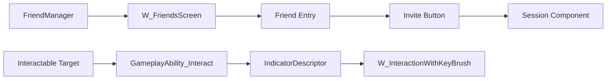

# Online / Friends / Interaction UI

## Online UI 资产

| 资产 | C++ 基类 / 作用 |
| --- | --- |
| `Content/UI/Online/Friend/W_FriendsScreen` | `UUI_FriendsScreen`，好友列表屏。 |
| `Content/UI/Online/Friend/W_FriendsInviteScreen` | 复用好友屏逻辑，用于邀请场景。 |
| `Content/UI/Online/Friend/W_FriendsListEntry` | `UUI_FriendsListEntry_Frontend`，好友列表条目。 |
| `Content/UI/Online/Friend/W_FriendsListEntry_Invite` | `UUI_FriendsListEntry_Invite`，带邀请按钮的条目。 |

## UUI_FriendsScreen

关键契约：

- 继承 `UCommonUserWidget`。
- BindWidget：`ListView_Friends`，类型是 `UUI_FriendsListView`。
- `NativeConstruct` 调 `RefreshFriendsList()`。
- `RefreshFriendsList` 从 FriendManager subsystem 获取好友 item 并 `SetListItems`。

BP 职责：

- 放置 `ListView_Friends`。
- 配置 list entry class。
- 做列表视觉、空状态、加载状态和筛选表现。

不要：

- 不要在 Widget graph 直接调用 Steam travel/join。
- 不要把好友显示名当唯一 ID；使用框架 PlayerID 或 Steam ID wrapper。

## UUI_FriendsListEntry

基类：

- `UUI_FriendsListEntryBase` 继承 `UCommonUserWidget` 并实现 `IUserObjectListEntry`。
- Optional BindWidget：
  - `Avatar`
  - `FriendName`

邀请子类：

- `UUI_FriendsListEntry_Invite` 添加 Optional BindWidget `InviteButton`。
- 初始化时绑定按钮点击。
- 点击后调用 Steam session invite wrapper。

扩展规则：

- 新增好友条目表现时，继承现有 entry base。
- 头像、昵称、在线状态来源于 FriendManager/Steam wrapper。
- 邀请结果或错误显示可以走 messaging subsystem 或页面事件，但 session join flow 交给 Session component/CommonSession。

## Interaction UI 资产

| 资产 | 作用 |
| --- | --- |
| `Content/UI/Interaction/W_Interact` | 普通交互提示视觉。 |
| `Content/UI/Interaction/W_InteractionWithKeyBrush` | 带 CommonActionWidget / EnhancedInput key brush 的交互提示。 |

## UUI_InteractionWithKeyBrush

关键契约：

- 继承 `UCommonUserWidget`。
- BindWidget：`InputActionWidget`，类型是 `UCommonActionWidget`。
- 默认变量：`InputAction`，类型是 EnhancedInput `UInputAction`。
- `NativeConstruct` 调 `InputActionWidget->SetEnhancedInputAction(InputAction)`。
- 提供 visibility changed 的 BlueprintImplementableEvent，给 BP 做动画。

BP 职责：

- 放置 `InputActionWidget`。
- 配置 `InputAction`，通常是交互输入动作。
- 显示 `FInteractionOption.Text` / `SubText` 或页面传入文本。
- 做出现/消失动画。

不要：

- 不要硬编码键鼠/手柄贴图。
- 不要在提示 Widget 中执行拾取、开箱、装备等服务器权威逻辑。

## IndicatorSystem 链路

交互提示由 IndicatorSystem 管理：

1. PlayerController 拥有 `UIndicatorManagerComponent`。
2. 交互 GA 或系统创建 `UIndicatorDescriptor`。
3. Descriptor 指向目标 actor/component 和 widget class。
4. Manager 根据屏幕/世界位置显示 Widget。
5. Widget 只处理表现和 key brush。

InteractionSystem/GAS 链路：

- 目标实现 `IInteractableTarget` 或继承 `AInteractionItem`。
- `FInteractionOption` 提供文本、目标 ability 和 widget class。
- 玩家侧 `UGameplayAbility_Interact` 扫描目标、创建 indicator、输入触发交互。
- 服务端权威路径再次校验距离、状态、所有权和可用性。

## Online / Interaction 流程图

## 验证清单

- Friends screen 有 `ListView_Friends`。
- Entry 的 optional widgets 缺失时 C++ 不崩溃，存在时能显示头像/名字。
- 邀请按钮只发起 invite，不直接 travel。
- PlayerController 有 IndicatorManagerComponent。
- 交互 Widget 有 `InputActionWidget` 且 `InputAction` 有效。
- key brush 随键鼠/手柄切换。
- 拾取/交互结果由服务器权威路径修改状态。
