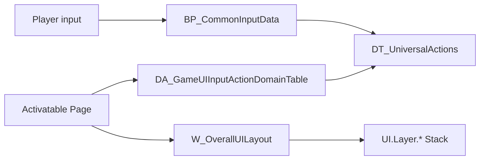

# UI Root / CommonInput / Action Domain

## 入口资产

| 资产 | 类型 | 作用 |
| --- | --- | --- |
| `Content/UI/BP_UIPolicy` | `UGameUIPolicy` Blueprint | 指定 root layout class。 |
| `Content/UI/W_OverallUILayout` | `UPrimaryGameLayout` Widget BP | 创建 CommonUI 根层栈并注册 `UI.Layer.*`。 |
| `Content/UI/BP_CommonInputData` | `UCommonUIInputData` Blueprint | 默认 click/back action row 和 EnhancedInput action。 |
| `Content/UI/DA_GameUIInputActionDomainTable` | `UGameUIInputActionDomainTable` DataAsset | CommonInput Action Domain + second back action。 |
| `Content/UI/DT_UniversalActions` | `FCommonInputActionDataBase` DataTable | `DefaultForward`、`DefaultBack`、`SecondBack` 等 UI action row。 |

## 配置链

`DefaultGame.ini`：

```ini
[/Script/GameUI.GameUIManagerSubsystem]
DefaultUIPolicyClass=/Game/UI/BP_UIPolicy.BP_UIPolicy_C

[/Script/CommonInput.CommonInputSettings]
InputData=/Game/UI/BP_CommonInputData.BP_CommonInputData_C
ActionDomainTable=/Game/UI/DA_GameUIInputActionDomainTable.DA_GameUIInputActionDomainTable
```

`DefaultInput.ini`：

```ini
[/Script/CommonUI.CommonUIInputSettings]
+InputActions=(ActionTag=UI.Action.Escape,...)
```

`DefaultGameplayTags.ini`：

```ini
UI.Layer.Game
UI.Layer.GameMenu
UI.Layer.Menu
UI.Layer.Modal
UI.Action.Back
UI.Action.Escape
```

## BP_UIPolicy

MCP 回读：

- CDO：`/Game/UI/BP_UIPolicy.Default__BP_UIPolicy_C`
- `LayoutClass=/Game/UI/W_OverallUILayout.W_OverallUILayout_C`

用法：

- 这个 BP 应保持 data-only。
- 修改 root layout 时只改 `LayoutClass`；不要在 policy BP 中写业务 graph。
- 新项目复用时，只需要保证 `DefaultUIPolicyClass` 指向该 BP，且 layout class 可加载。

## W_OverallUILayout

MCP 深读：

- Parent：`/Script/CommonGame.PrimaryGameLayout`
- Root widget：`/Script/UMG.Overlay`
- WidgetTree：
  - `MainOverlay`：`Overlay`
  - `GameLayer_Stack`：`CommonActivatableWidgetStack`，变量
  - `GameMenu_Stack`：`CommonActivatableWidgetStack`，变量
  - `Menu_Stack`：`CommonActivatableWidgetStack`，变量
  - `Modal_Stack`：`CommonActivatableWidgetStack`，变量
- EventGraph：
  - `Event OnInitialized`
  - `RegisterLayer(UI.Layer.Game, GameLayer_Stack)`
  - `RegisterLayer(UI.Layer.GameMenu, GameMenu_Stack)`
  - `RegisterLayer(UI.Layer.Menu, Menu_Stack)`
  - `RegisterLayer(UI.Layer.Modal, Modal_Stack)`

扩展规则：

1. 新增 layer 先在 GameplayTags 中定义 `UI.Layer.<Name>`。
2. 在 `W_OverallUILayout` 添加 `CommonActivatableWidgetStack` 或合适的 `UCommonActivatableWidgetContainerBase` 派生控件。
3. 控件命名使用 `<Name>_Stack`，并设为变量。
4. 在 `OnInitialized` 里追加 `RegisterLayer`，不要在 Construct 或 Tick 中重复注册。
5. 使用 `CommonUIExtensions::PushContentToLayer_ForPlayer` 或 GameFeature Add Widgets 推入层。

不要做：

- 不要把 gameplay HUD、菜单页面或弹窗直接 AddToViewport。
- 不要在 root layout 中写具体业务流程。
- 不要删除现有四个 layer；大量系统依赖它们。

## BP_CommonInputData

MCP 回读属性名和值：

| 属性 | 当前值 |
| --- | --- |
| `defaultClickAction` | `DT_UniversalActions.DefaultForward` |
| `defaultBackAction` | `DT_UniversalActions.DefaultBack` |
| `defaultHoldData` | `None` |
| `enhancedInputClickAction` | `None` |
| `enhancedInputBackAction` | `None` |

注意：通过 `ObjectTools.get_properties` 访问 CDO 时，属性名是小写开头的反射名，例如 `defaultBackAction`，不是 `DefaultBackAction`。

扩展规则：

- 默认 click/back 应优先改 DataTable row 或 CommonInputData，不要在每个 Widget 中单独绑定键。
- 如果切到 EnhancedInput click/back action，必须同步验证 CommonInput settings 的 EnhancedInput support、Action Domain 和页面 action binding。
- 更改后要在键鼠、手柄至少验证 back/click。

## DA_GameUIInputActionDomainTable

MCP 回读：

| 属性 | 当前值 |
| --- | --- |
| `secondBackAction` | `DT_UniversalActions.SecondBack` |
| `enhancedInputSecondBackAction` | `None` |
| `actionDomains` | 空数组 |
| `inputMode` | `Game` |
| `mouseCaptureMode` | `CapturePermanently` |

源码契约：

- `UGameUIInputActionDomainTable` 继承 `UCommonInputActionDomainTable`。
- 额外字段 `SecondBackAction` 和 `EnhancedInputSecondBackAction` 被 `UUI_ActivatableWidget`、`UUI_UserSettingScreen` 等读取。
- 如果 `SecondBackAction` 对应键是鼠标按钮，页面可通过 `NativeOnMouseButtonDown` 处理右键返回。

扩展规则：

- 新增第二返回语义时，优先新增 DataTable row 并配置到 ActionDomainTable。
- 页面只声明自己是否 `bIsSecondBackHandler`，不要直接解析 DataTable。
- 如果添加 action domain entries，要验证输入事件优先级、input mode 和 mouse capture。

## DT_UniversalActions

DataTable row struct 是 `/Script/CommonUI.CommonInputActionDataBase`。当前通过 MCP/离线字符串确认的关键 row：

- `DefaultForward`
- `DefaultBack`
- `SecondBack`

`DefaultBack` 和 `SecondBack` 的显示名都可见为 `Back`，其中 `DefaultBack` 已进入本地化 manifest。

维护规则：

- RowName 是代码/资产引用契约，不能随意改名。
- 新增 action row 要同步本地化、CommonInputData 或 ActionDomainTable 引用。
- 不要用 UI 文本当 row identity。

## Root/Input 用例图



## 验证

- `BP_UIPolicy.LayoutClass` 指向可加载 root layout class。
- `W_OverallUILayout` WidgetTree 有四个 stack 且 `RegisterLayer` 顺序清晰。
- `BP_CommonInputData` CDO row handle 有效。
- `DA_GameUIInputActionDomainTable.secondBackAction` row 存在。
- `DT_UniversalActions` 中被引用 row 没有改名。
- 键鼠和手柄 back/click/second back 行为都验证。
