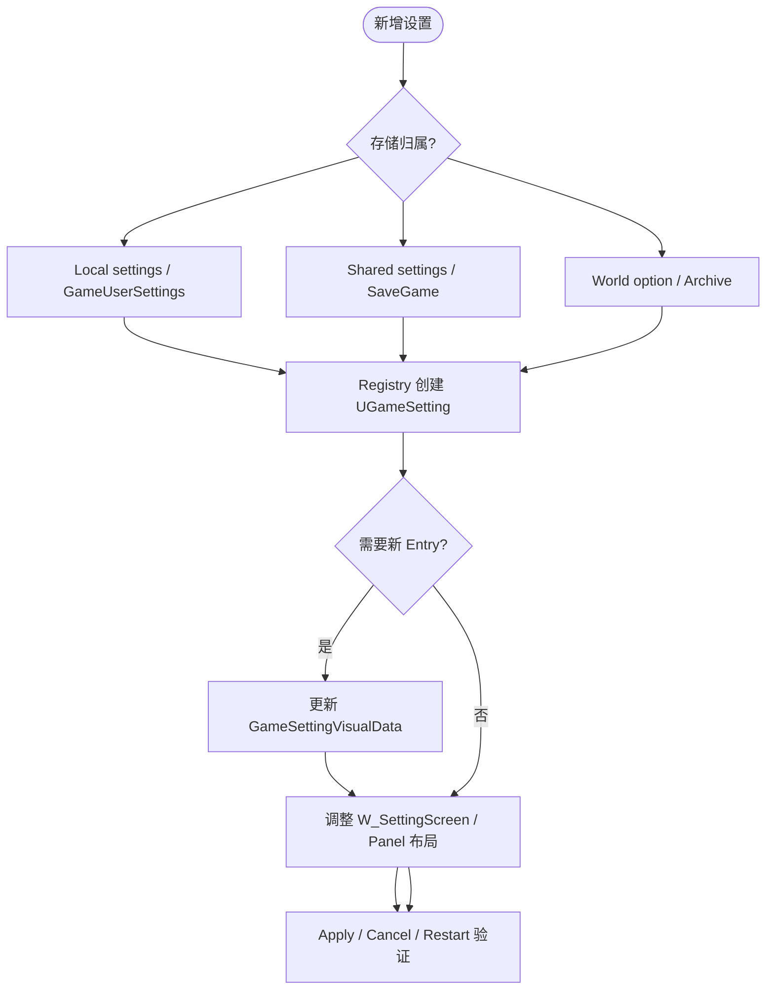

# Settings UI / GameSettings VisualData

## 资产族

| 资产 | 作用 |
| --- | --- |
| `Content/UI/Settings/GameSettingRegistryVisuals` | 玩家设置 VisualData，决定 setting class/name 到 entry widget 的映射。 |
| `Content/UI/Settings/GameWorld/GameWorldSettingRegistryVisuals` | 世界/房间设置 VisualData。 |
| `Content/UI/Settings/W_SettingScreen` | 玩家设置页。 |
| `Content/UI/Settings/GameWorld/W_GameWorldSettingScreen` | 世界/房间设置页。 |
| `Content/UI/Settings/W_SettingsPanel`、`W_GameWorldSettingsPanel` | 设置列表和详情区域。 |
| `Content/UI/Settings/Editors/W_SettingsListEntry_*` | 不同 setting 类型的 list entry。 |
| `Content/UI/Settings/Screens/W_SettingsKBMBinding_*` | 输入改键弹窗和重复绑定警告。 |

## C++ 分层

GameSettings 插件负责通用模型：

- `UGameSetting`
- `UGameSettingValue`
- `UGameSettingRegistry`
- `UGameSettingScreen`
- `UGameSettingPanel`
- `UGameSettingListView`
- `UGameSettingVisualData`

GameUI 项目层负责 UI glue：

- `UUI_UserSettingScreen`
- `UUI_GameWorldSettingScreen`
- `UUI_UserSettingsListEntry_Input`

宿主 Game 模块负责具体 registry 和 settings object：

- `UOrionGameSettingRegistry`
- `UOrionGameWorldSettingRegistry`
- `UOrionSettingsLocal`
- `UOrionSettingsShared`

## UUI_UserSettingScreen

关键行为：

- `CreateRegistry()` 返回玩家设置 registry。
- `NativeConstruct()` 注册 Apply、Cancel、SecondBack action。
- Dirty 时显示/启用应用和取消。
- Back 时如果有 dirty setting，会触发 BlueprintImplementableEvent `OnShowBackWidget`。
- 鼠标右键可作为 second back，取决于 ActionDomainTable 的 row。

BP 必需/常用：

- `TopSettingsTabs`：可选 BindWidget，用于顶层设置分类 tab。
- `OnShowBackWidget`：显示“是否放弃未应用修改”之类确认 UI。
- Apply/Cancel action data：默认变量指向 CommonInput action row。

不要：

- 在 Widget graph 直接保存 ini、写 CVar 或调用 settings object setter 绕过 ChangeTracker。
- 为新设置项单独写一个页面级数组；新增 setting 应先进入 registry。

## UUI_GameWorldSettingScreen

关键行为：

- `CreateRegistry()` 返回世界/房间设置 registry。
- BindWidget：
  - `TopSettingsTabs` 可选
  - `ConfirmButton` 必需
  - `CancelButton` 必需
  - `CancelChangesButton` 可选
- Confirm 会 `ApplyChanges()`，然后根据当前前端 phase 调 `OnCreateSession` 或返回。
- Cancel 走世界退出/返回流程。
- Back dirty 时调用 `OnShowBackWidget`。

BP 职责：

- 放置 settings panel、按钮和确认/返回弹窗。
- 实现 `OnCreateSession` 和 `OnShowBackWidget` 的视觉/流程 glue。
- 不直接修改 WorldOption 存储；registry/savegame 负责保存。

## VisualData

`UGameSettingVisualData` 控制 setting 到 entry/extension 的映射：

- `EntryWidgetForClass`
- `EntryWidgetForName`
- `ExtensionsForClasses`
- `ExtensionsForName`

扩展规则：

1. 如果新增 setting 使用已有 `UGameSettingValueScalarDynamic`、`UGameSettingValueDiscreteDynamic`、`UGameSettingAction`、`UGameSettingValueEditable_String`，通常复用现有 class mapping。
2. 如果新增自定义 setting class，必须检查 VisualData 是否需要新 entry。
3. 如果某个 DevName 要特殊表现，用 `EntryWidgetForName` 做精确映射。
4. VisualData 是 UI 映射，不是业务存储。

## Entry Widgets

常见 entry：

- `W_SettingsListEntry_Action`
- `W_SettingsListEntry_Discrete`
- `W_SettingsListEntry_EditableString`
- `W_SettingsListEntry_Header`
- `W_SettingsListEntry_InputBinding`
- `W_SettingsListEntry_Missing`
- `W_SettingsListEntry_Scalar`
- `W_SettingsListEntry_SubCollection`

`UUI_UserSettingsListEntry_Input` 负责输入改键：

- BindWidget：
  - `Button_MouseAndKeyboardFirst`
  - `Button_MouseAndKeyboardSecond`
  - `Button_GamepadFirst`
  - `Button_ResetToDefault`
- 弹窗 class：
  - `PressAnyKeyPanelClass`
  - `KeyAlreadyBoundWarningPanelClass`
- 使用 `UGameSettingInput::ChangeBinding` 修改 EnhancedInput user settings。
- 弹窗推入 `UI.Layer.Modal`。

不要硬编码 `UInputAction` 到 Entry；正确链路是：

1. `InputAction/IMC` 启用 Player Mappable。
2. 输入系统把 mapping 暴露给 user settings。
3. Registry 扫描 mapping，生成 `UGameSettingInput`。
4. VisualData 映射到 `W_SettingsListEntry_InputBinding`。
5. Entry 调 `UGameSettingInput` 改键。

## 新增设置流程

## 验证清单

- `DevName` 唯一且稳定。
- 设置文案使用可收集 `FText`。
- Registry 初始化完成后设置可见。
- VisualData 能找到 entry class。
- Apply 保存并生效。
- Cancel 恢复 initial value。
- Back dirty 会走确认流程。
- 输入改键验证键鼠和手柄，重复绑定警告可弹出。
- Widget BP 不承担业务保存逻辑。
