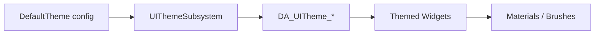

# UI Theme / Art

## 资产族

| 目录/资产 | 作用 |
| --- | --- |
| `Content/UI/Art/Theme/DA_UITheme_Defualt` | 默认 UI 主题数据。 |
| `Content/UI/Art/Theme/DA_UITheme_YellowGreen` | 另一套主题数据。 |
| `Content/UI/Art/W_ArtBorderStyle1` | 主题化边框控件 1。 |
| `Content/UI/Art/W_ArtBorderStyle2` | 主题化边框控件 2。 |
| `Content/UI/HUD/Art` | HUD 材质、贴图、准星、击杀提示等美术资源。 |
| `Content/UI/Menu/Art` | 菜单按钮、边框、地图 tile、社媒图标、设置页材质等。 |

## UIThemeData

`UUIThemeData` 是主题数据资产。MCP schema 确认关键属性：

- `mainThemeColor`：`FLinearColor`

配置入口：

```ini
[/Script/GameUI.UIThemeSubsystem]
DefaultTheme="/Game/UI/Art/Theme/DA_UITheme_Defualt.DA_UITheme_Defualt"
```

扩展规则：

1. 新增主题时创建新的 `UUIThemeData` DataAsset。
2. 保持主题资产只存主题参数，不引用具体页面业务。
3. 需要默认主题时改配置或 UIThemeSubsystem 默认值。
4. 运行时切换主题应通过 `UUIThemeSubsystem::SetTheme`。

## UIThemeSubsystem

`UUIThemeSubsystem`：

- GameInstanceSubsystem。
- 从 config 加载 `DefaultTheme`。
- 保存 `CurrentTheme`。
- 提供 `OnThemeChanged` 动态多播。

控件响应主题：

- 继承 `UThemedUserWidget`，或
- 实现 `IUIThemeInterface` 并在主题变化时执行 `ApplyTheme`。

## ThemedArtBorderStyle

`W_ArtBorderStyle1`、`W_ArtBorderStyle2` 对应 C++：

- `UThemedArtBorderStyle1`
- `UThemedArtBorderStyle2`

用途：

- 作为菜单/HUD 中复用的视觉边框。
- 响应主题色变化。
- 把材质/颜色应用集中到可复用控件，而不是每个页面重复配置。

扩展：

1. 新增主题化视觉控件时，优先继承 themed C++ 基类。
2. BP 中放美术层、材质、动态材质参数和动画。
3. 主题变化的逻辑放 C++ 或统一 BP event，不要散落在页面 tick。

## Art 资源边界

Art 目录通常包含：

- Material / Material Instance
- Texture
- Curve / CurveAtlas
- Font / Brush / Style
- 纯视觉 Widget

不要把业务状态放进 Art：

- 不在材质或纯 Art Widget 中决定 Session、设置保存、交互结果。
- 不把输入按键贴图硬编码成单个平台图标；按键图标走 CommonInput controller data。
- 不把 LoadingScreen 视频或启动 Splash 混入普通 UI Art；视频走 `Content/Movies`，启动 Splash 走 `Content/Splash`。

## Theme 流程图



## 验证清单

- `DA_UITheme_*` 可加载，`mainThemeColor` 有效。
- 默认主题配置指向存在资产。
- Themed widget 能在构造/主题切换时应用主题。
- 主题切换不依赖 Tick。
- Art 资源命名、目录符合资产规范。
- 玩家可见文本仍走本地化，不写进材质名或贴图名。
